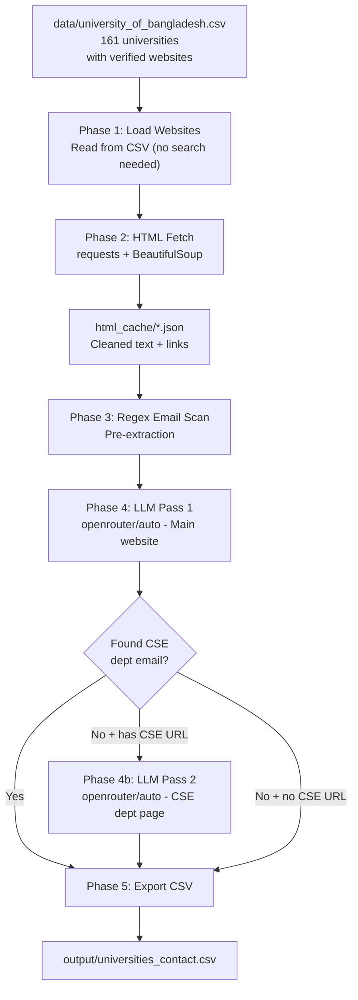

# BD University Contact Info Scraper

Scrape contact information (registrar email, CSE department email, CSE department head email) from ~161 Bangladeshi university websites using Python, BeautifulSoup, and OpenRouter LLM.

University websites are pre-verified from the **University Grants Commission (UGC)** of Bangladesh official list.

## Pipeline



## Project Structure

```
D:\Development\bd_uni_contact_info\
├── pyproject.toml
├── requirements.txt
├── .env
├── data/
│   └── university_of_bangladesh.csv    # Input with verified websites
├── src/scraper/
│   ├── config.py                       # Settings + env vars
│   ├── models.py                       # UniversityRecord, PageData
│   ├── discovery/website_finder.py     # Phase 1: Load websites from CSV
│   ├── fetcher/html_fetcher.py         # Phase 2: HTTP fetch + parse
│   ├── extraction/
│   │   ├── email_regex.py             # Regex pre-extraction
│   │   ├── llm_client.py              # OpenRouter API client
│   │   └── llm_extractor.py           # LLM-based extraction
│   ├── pipeline/orchestrator.py       # Pipeline runner
│   └── export/csv_exporter.py         # Final CSV export
├── output/                             # Generated artifacts
└── logs/                               # scraper.log
```

## Prerequisites

- Python 3.11+
- pip

## Installation

```bash
python -m venv .venv
.venv\Scripts\activate
pip install -r requirements.txt
```

On macOS/Linux use `source .venv/bin/activate` instead.

## Configuration

Create a `.env` file in the project root:

```
OPENROUTER_API_KEY=sk-or-your-key-here
```

Get your API key from [OpenRouter](https://openrouter.ai/).

## Usage

### Full Pipeline

```bash
python -m scraper
```

### Individual Steps

```bash
python -m scraper --step 1    # load websites (reads from CSV)
python -m scraper --step 2    # fetch HTML
python -m scraper --step 3    # LLM extraction pass 1
python -m scraper --step 4    # LLM extraction pass 2
python -m scraper --step 5    # export CSV
```

### Options

```bash
python -m scraper --no-resume    # ignore caches, start fresh
python -m scraper --api-key sk-or-...  # pass API key directly
```

## Input Data

The CSV at `data/university_of_bangladesh.csv` contains 161 universities with columns:

| Column | Description |
|--------|-------------|
| University | Full university name |
| Acronym | Short abbreviation |
| Established | Year of establishment |
| Location | City/district |
| Division | Administrative division |
| Specialization | General, Science & Technology, etc. |
| Type | Public, Private, International |
| Ph.D. granting | Yes/No |
| Website | Verified website URL from UGC list |

Websites are sourced from the official [UGC Bangladesh](http://www.ugc.gov.bd/) university list.

## Output Format

The final CSV (`output/universities_contact.csv`) contains:

| Column | Description |
|--------|-------------|
| University | Full university name |
| Acronym | Short abbreviation |
| Website | Website URL |
| Registrar_Email | Registrar office email |
| CSE_Dept_Email | CSE/CS/ICT department email |
| CSE_Dept_Head_Email | CSE department head/chair email |
| Email_Source | How the email was found |
| CSE_Dept_URL | URL to CSE department page |
| Notes | Any error/status notes |

## Architecture Decisions

- **Pre-verified websites**: URLs from UGC list, no search engine scraping needed
- **Two-pass LLM extraction**: Pass 1 for main website, Pass 2 for CSE dept page fallback
- **File-based caching**: JSON caches for resumable runs without database overhead
- **`openrouter/auto`**: Lets OpenRouter pick the best free model for each request

## Estimated Runtime

| Phase | Time |
|-------|------|
| Phase 1 (load CSV) | < 1 sec |
| Phase 2 (fetch HTML) | 5-10 min |
| Phase 3 (LLM pass 1) | 10-15 min |
| Phase 4 (LLM pass 2) | 5 min |
| **Total** | **~20-30 min** |

## Troubleshooting

- **SSL errors**: Some university sites have expired certificates. These are logged and skipped.
- **Rate limits (OpenRouter)**: Auto-retries with exponential backoff. Use `--resume` to continue from cache.
- **Missing emails**: Not all universities publish contact emails publicly. Check the `Notes` column.

## License

MIT
